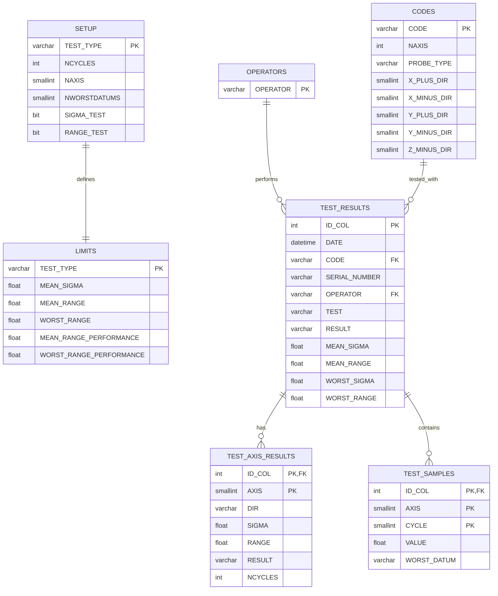

# MINIAS 데이터베이스 ER 다이어그램

## 테이블 관계 요약

| 관계 | 설명 |
|------|------|
| OPERATORS → TEST_RESULTS | 작업자가 테스트 수행 |
| CODES → TEST_RESULTS | 프로브 코드로 테스트 |
| TEST_RESULTS → TEST_AXIS_RESULTS | 1:N (테스트당 여러 축) |
| TEST_RESULTS → TEST_SAMPLES | 1:N (테스트당 여러 샘플) |

## 핵심 테이블 설명

### TEST_RESULTS (테스트 결과)
- 프로브 측정 테스트의 최종 결과
- MEAN_SIGMA, MEAN_RANGE: 평균 시그마/범위
- WORST_SIGMA, WORST_RANGE: 최악 시그마/범위
- RESULT: 합격/불합격 여부

### TEST_AXIS_RESULTS (축별 결과)
- X, Y, Z 각 축의 측정 결과
- DIR: 방향 (+/-)
- 축별 SIGMA, RANGE 값

### TEST_SAMPLES (샘플 데이터)
- 각 축, 각 사이클의 원시 측정값
- CYCLE: 반복 측정 회차
- VALUE: 실제 측정값

### CODES (프로브 코드)
- PROBE_TYPE: 프로브 종류
- NAXIS: 측정 축 수
- X/Y/Z_DIR: 각 축 방향 설정

### LIMITS (한계값)
- TEST_TYPE별 합격 기준값
- MEAN/WORST SIGMA/RANGE 한계
