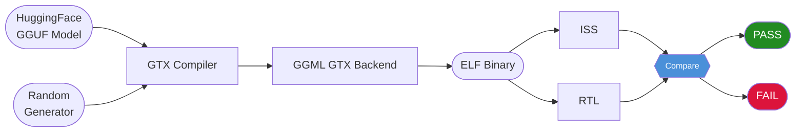

```mermaid
flowchart LR
    HF(["HuggingFace<br>GGUF Model"])
    RG(["Random<br>Generator"])

    HF --> COMP
    RG --> COMP

    COMP["GTX Compiler"]
      --> BACKEND["GGML GTX Backend"]
      --> ELF(["ELF Binary"])

    ELF --> ISS["ISS"]
    ELF --> RTL["RTL"]

    ISS --> CMP{{"Compare"}}
    RTL --> CMP

    CMP --> PASS(["PASS"])
    CMP --> FAIL(["FAIL"])

    style CMP fill:#4A90D9,color:#fff,font-size:12px
    style PASS fill:#228B22,color:#fff
    style FAIL fill:#DC143C,color:#fff
```